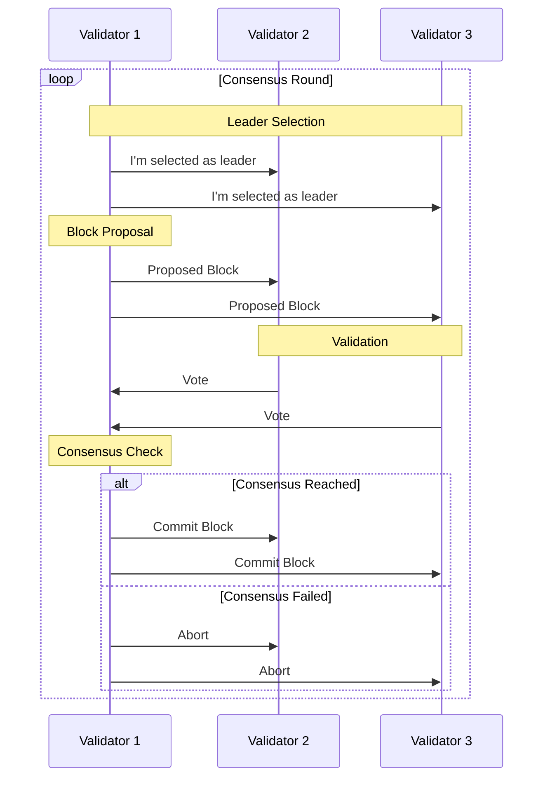

# Simplified Proof-of-Stake (PoS) Consensus in Golang

## Project Overview

This project implements a simplified Proof-of-Stake consensus algorithm in Go to demonstrate how validator selection and block validation work in PoS systems.

## Project Structure

```
pos-consensus/
├── blockchain/          # Core blockchain structures
│   ├── block.go         # Block structure and methods
│   └── chain.go         # Blockchain management
├── consensus/           # Consensus logic
│   ├── validator.go     # Validator management
│   ├── selection.go     # Leader selection algorithm
│   └── validation.go    # Block validation logic
├── network/             # Network simulation
│   ├── node.go          # Node implementation
│   └── message.go       # Message types
├── main.go              # Entry point and simulation runner
└── README.md            # This file
```


## Key Components to Implement
### 1. Core Structures

- **Block**: Simple structure with index, timestamp, data, previous hash, and validator

- **Validator**: Node with ID, stake amount, and voting power

- **Blockchain**: Maintain chain state and pending transactions

### 2. Consensus Mechanism

1. **Validator Registration**: Nodes join as validators with assigned stakes

2. **Leader Selection**:

    - Weighted random selection based on stake

    - Consider "time" factor to prevent stake concentration

3. **Block Proposal**: Selected leader creates new block

4. **Validation**: Other validators verify the proposed block

5. **Commit**: If consensus reached, block is added to chain

### 3. Concurrency Patterns

- Use Goroutines for each validator node

- Channels for communication between nodes

- Mutexes for shared state protection

- Select statements for handling multiple channel operations

## Getting Started

### Prerequisites

- Go 1.20+ installed

- Basic understanding of blockchain concepts

- Familiarity with Go concurrency patterns

## Implementation Approach

1. **Setup Basic Structures**:

    - Define Block and Blockchain types

    - Create Validator struct with stake amount

2. **Implement Leader Selection**:

    - Create weighted random selection algorithm

    - Incorporate time-based adjustments

3. **Build Consensus Flow**:

    - Simulate block proposal by leader

    - Implement validation by other nodes

    - Handle consensus achievement logic

4. **Add Concurrency**:

    - Make each validator run in its own goroutine

    - Set up communication channels

    - Handle synchronization properly


## Suggested Flow
Diagram




## Learning Outcomes

- Understand PoS consensus fundamentals

- Practice Go concurrency patterns

- Learn distributed system principles

- Implement cryptographic basics (hashing)

- Handle race conditions in distributed systems


## Project Extensions (Future Work)

- Add stake delegation features

- Implement slashing conditions for misbehavior

- Add network latency simulation

- Create visualization of consensus process

## How to Run
- Clone the repository

- Build the project: go build

- Run the simulation: ./pos-consensus